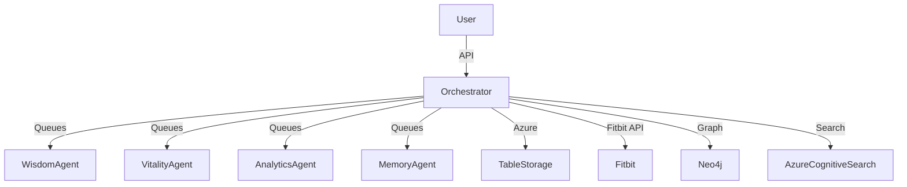

# LifeVault Orchestrator

**LifeVault Orchestrator** is a multi-agent orchestration system designed to optimize and guide personal growth, health, and productivity using advanced AI and data integration. It coordinates several specialized AI agents—each with unique capabilities—to deliver actionable insights, strategic guidance, and automated data processing for the LifeVault platform.

## What Does It Do?

- **Multi-Agent AI Orchestration:**  
	Coordinates four core agents—Wisdom, Vitality, Analytics, and Memory—each focused on a different aspect of personal optimization:
	- **WisdomAgent:** Strategic life guidance, decision frameworks, and accountability coaching.
	- **VitalityAgent:** Fitness, nutrition, sleep, fasting, and energy optimization.
	- **AnalyticsAgent:** Pattern recognition, causation analysis, and predictive insights across all life domains.
	- **MemoryAgent:** Advanced memory storage, retrieval, and semantic search using Azure Table Storage and vector search.

- **Data Integration:**  
	Connects to Fitbit APIs, Azure Table Storage, Neo4j (for graph-based memory), and Azure Cognitive Search for deep data analysis and retrieval.

- **API Endpoints:**  
	Exposes endpoints for coach interactions, Fitbit data sync, meal logging, and more, via both a Node.js HTTP server and Azure Functions.

- **Event-Driven Messaging:**  
	Uses Azure Service Bus for robust, asynchronous communication between agents and the orchestrator.

- **Personalized Insights:**  
	Synthesizes data from multiple sources to provide tailored recommendations, habit tracking, and progress analysis.

---

## Architecture Overview



---

## Quick Start

### Prerequisites

- Node.js (LTS)
- Azure Functions Core Tools
- Azure Service Bus, Table Storage, Cognitive Search, and OpenAI resources (for full functionality)
- Fitbit developer credentials (for Fitbit integration)

### 1. Clone and Install

```powershell
git clone https://github.com/Azureknight10/lifevault-orchestrator.git
cd lifevault-orchestrator
npm install
```

### 2. Configure Environment

Create a `.env` file with your Azure and Fitbit credentials. See `local.settings.json` for required keys.

### 3. Start the Node Server (Coach API)

```powershell
node server.js
```

Coach endpoint available at:
- http://localhost:3000/api/coach-lite

### 4. Start the Functions Host (Fitbit + Meals)

Recommended (CORS for the Lite UI):

```powershell
func host start --cors http://localhost:5500
```

Functions host listens on:
- http://localhost:7071/api

### 5. Verify Endpoints

- http://localhost:7071/api/fitbit/summary/yesterday?date=YYYY-MM-DD
- http://localhost:7071/api/meals/recent?userId=user-1&limit=5

---

## Troubleshooting

- **Port 3000 in use:** Stop the process using it, then rerun `node server.js`.
- **Functions unreachable:** Ensure the host is running on 7071.
- **Azure connection issues:** Double-check your `.env` and Azure resource access.

---

## Technologies Used

- Node.js, Express, Azure Functions
- Azure Service Bus, Table Storage, Cognitive Search, OpenAI
- Neo4j (graph database)
- Fitbit Web API

---

## License

ISC
